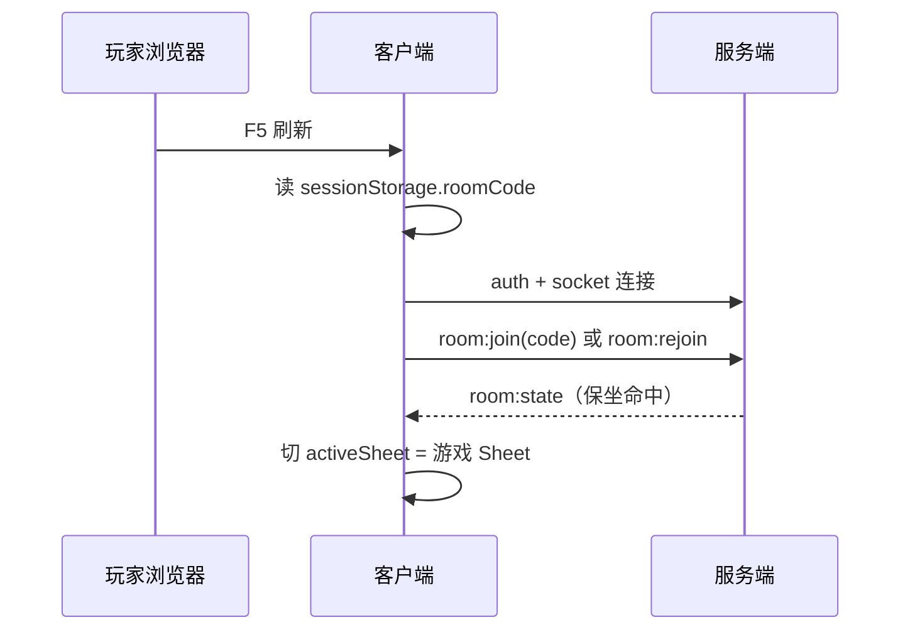

# PRD · REQ-2026-003 · UX 与玩法体验补全

- **版本**：v1
- **作者**：prd-author
- **状态**：①已定稿 → ②评审会签中
- **时间**：2026-07-03
- **前置**：REQ-2026-001（账号/大厅）、REQ-2026-002（M3 锦囊/正式房）
- **SSOT 声明**：自本文档 v1 定稿并通过 ②评审起，**本轮功能流程以本文档为准**，直至产品下次显式更新 PRD。

## 1. 背景与目标

### 1.1 现状问题

玩家在 M3 与正式房联调中反馈六类体验/规则缺口：

1. **刷新丢上下文**：浏览器刷新后回到大厅首页，对局/等待中的房间视图丢失；误点 Sheet 标签回大厅后无法一键回到原房间。
2. **身份展示混乱**：界面多处展示 QQ 邮箱或武将名，玩家难以辨认「谁是谁」；注册无二次确认密码；昵称不可改。
3. **锦囊结算中断**：【南蛮入侵】打出后，若有人被询问【无懈可击】并选择「不出」，后续目标未继续响应【杀】，对局卡住；其它多目标锦囊可能存在同类断链。
4. **对局区未铺满**：大厅列表区已按 REQ-001 R-2 优化，但**游戏 Sheet（等待大厅 + 对局表格）**仍存在空白单元格区域。
5. **选将流程缺失**：开局直接随机分配武将，未按三国杀规则进入「身份分配 → 选将 → 发起始手牌」流程。
6. **房间聊天不便**：房间内聊天仅能通过公式栏发送，聊天区下方无输入框（大厅聊天区已有）。

### 1.2 价值主张

让玩家在 WPS 伪装壳内获得**可恢复、可辨认、规则正确、视觉完整**的联机身份局体验。

### 1.3 成功指标

| 指标 | 目标 |
|---|---|
| 刷新恢复 | 登录用户在 `reconnectGraceSec`（默认 5min）内刷新，**100%** 自动回到原房间视图（等待或进行中） |
| 误回大厅重进 | 玩家从房间 Sheet 切回大厅后，**≤2 次点击**（房间列表找到本房 → 加入）回到原座位 |
| 昵称一致性 | 聊天、房间列表、大厅表格、对局日志中玩家标识 **100% 使用账号昵称**（武将名单独标注） |
| 南蛮/万箭闭环 | 【南蛮入侵】【万箭齐发】在「无懈询问链结束」后，**所有存活目标均收到响应询问**，无卡死 |
| 对局区铺满 | 游戏 Sheet 三档分辨率（1440×900 / 1920×1080 / 2560×1440）非背景色像素占视口 **≤ 3%** |
| 选将完成率 | 开局后全员在 **60s** 内完成选将（超时由服务端默认选第一张候选将） |

---

## 2. 用户 & 场景

| 用户 | 场景 |
|---|---|
| 联机玩家 | 等待大厅中刷新页面，希望仍停在房间准备界面 |
| 联机玩家 | 对局进行中误点「工作表1」回大厅，希望从房间列表再次进入并恢复视角 |
| 新注册用户 | 注册时输错密码，希望二次确认拦截 |
| 老玩家 | 希望改昵称，且各处显示昵称而非邮箱 |
| 出牌玩家 | 打出【南蛮入侵】，期望所有目标依次响应【杀】 |
| 房主 | 点击开始后，按三国杀流程选将再进入回合 |
| 房间内社交 | 在右侧聊天区底部直接打字发消息 |

---

## 3. 需求点列表

### 3.1 承接项（REQ-2026-001 / 002 未完成，本期继续交付）

| 编号 | 需求点 | 优先级 | 来源 | 本期状态 |
|---|---|---|---|---|
| R-CF-01 | 【五谷丰登】【借刀杀人】完整结算 | P0 | REQ-002 R-M3-01/02 | 继续验收 |
| R-CF-02 | AOE（南蛮/万箭）TargetQueue 逐目标响应 | P0 | REQ-002 R-M3-03 | **与 R-ENG-01 合并修复** |
| R-CF-03 | 【八卦阵】响应【杀】/【万箭】判定当闪 | P0 | REQ-002 R-M3-04 | 继续验收 |
| R-CF-04 | 正式房 Ribbon/表格准备、playerId 重连对齐 | P0 | REQ-002 R-FR-01~05 | 继续验收 |
| R-CF-05 | 大厅列表区单元格铺满（≤3% 空白） | P0 | REQ-001 R-2 | 已交付，回归 |
| R-CF-06 | 账号注册/登录/大厅聊天/版本切换 | P0 | REQ-001 R-3~R-9 | 已交付，回归 |

### 3.2 本轮新增

| 编号 | 需求点 | 优先级 | 备注 |
|---|---|---|---|
| R-UX-01 | **刷新保持视图**：刷新后自动恢复房间上下文（等待大厅或对局 Sheet），不回到纯大厅首页 | P0 | 依赖断线保坐 |
| R-UX-02 | **误回大厅可重进**：房间列表展示本人所在/最近房间，可点击重新进入（保坐期内免输房间号） | P0 | 与 R-UX-01 配套 |
| R-ACCT-01 | **全局展示昵称**：所有面向玩家的文案（聊天、房间列表房主、大厅表格、状态栏、对局日志玩家名）显示**账号昵称**；QQ 邮箱仅用于登录/找回 | P0 | 武将名仅在武将/技能上下文展示 |
| R-ACCT-02 | **编辑昵称**：已登录用户可修改昵称（Ribbon 或账号菜单入口），改后全局即时同步 | P1 | 2–12 字，禁纯空白 |
| R-ACCT-03 | **注册二次确认密码**：注册表单增加「确认密码」，两次不一致禁止提交并提示 | P0 | |
| R-ENG-01 | **无懈后继续结算**：任意锦囊在无懈可击询问链（全员「不出」）结束后，必须继续进入该锦囊的后续结算（如南蛮 TargetQueue） | P0 | 已知缺陷修复 |
| R-ENG-02 | **锦囊响应链排查**：对【万箭齐发】【决斗】【借刀杀人】【五谷丰登】等多段/多目标锦囊做同类断链排查并修复 | P0 | 交付时附排查清单 |
| R-UI-01 | **对局界面单元格铺满**：游戏 Sheet（`LobbyGrid` + `BattleGrid`）满足 REQ-001 §4.6 的 ≤3% 判据 | P0 | 扩展 R-2 范围 |
| R-GAME-01 | **选将阶段**：房主开始游戏后，先分配身份，再进入选将阶段（非直接随机武将） | P0 | 见 §4.5 |
| R-GAME-02 | **选将数量**：主公 **5 将选 1**；其他角色 **3 将选 1**；按座次从主公起依次选 | P0 | 标准身份局规则 |
| R-CHAT-01 | **房间内聊天输入框**：房间右侧聊天区底部增加输入框 + 发送按钮（或 Enter 发送），与大厅聊天区交互一致 | P1 | 公式栏发送保留 |

### 3.3 非目标（本期仍不做）

- 观战模式
- 木牛流马「粮」完整机制（REQ-002 已声明）
- 青龙偃月刀 / 贯石斧 / 方天画戟 / 麒麟弓 武器追伤
- M4 全 30 将技能
- 自动化 E2E 执行（用例设计可先行，执行后置）
- 邮箱验证 / 找回密码邮件（QQ 邮箱仍仅作账号名）
- 换将卡 / 点将卡

---

## 4. 交互设计

### 4.1 刷新保持与重进（R-UX-01 / R-UX-02）

**持久化（客户端）**

- 登录用户进入房间后，将 `{ roomCode, activeSheet, enteredAt }` 写入 `sessionStorage`（标签页级）。
- 刷新后加载顺序：`hydrate 登录` → `socket 连接` → 若 sessionStorage 有 roomCode 且用户已登录 → 自动 `room:join`（或专用 `room:rejoin`）→ 恢复 `activeSheet` 为游戏 Sheet。

**服务端**

- 保坐期内（`reconnectGraceSec`，默认 300s）：玩家座位保留，`room:join` 同 code 命中原座位则静默重绑，不新增座位。
- 对局进行中重进：下发过滤后的 `room:state` + 必要时 `game:sync`，恢复当前 prompt。

**误回大厅（R-UX-02）**

- 房间列表增加视觉提示：本人所在房间行高亮（如浅蓝底）+ 「进行中」/「等待中」状态列。
- 单击该行或「加入」列（本人已在房内时文案为「返回」）→ 一键回到房间，无需记忆房间号。
- 保坐期外：行显示「已结束」或消失，不可重进。



### 4.2 昵称体系（R-ACCT-01 / R-ACCT-02）

**展示规则**

| 场景 | 显示 | 不显示 |
|---|---|---|
| 聊天消息发送者 | 昵称 | 邮箱 |
| 房间列表「房主」列 | 昵称 | 邮箱 |
| 大厅等待表格「昵称」列 | 昵称 | 邮箱 |
| 对局日志「玩家动作」 | 昵称（可附武将名：`昵称（关羽）`） | 单独用邮箱 |
| 公式栏 / 状态栏当前用户 | 昵称 | 邮箱 |
| 武将技能弹窗标题 | 武将名 + 技能 | — |

**编辑昵称（R-ACCT-02）**

- 入口：Ribbon「账号」下拉 →「修改昵称」，或公式栏 `/nickname 新昵称`。
- 校验：2–12 字符；不可与当前相同；服务端判重（同账号忽略）。
- 成功后：更新账号表 → 广播 `user:nicknameChanged` → 所在房间 `room:state` 刷新该玩家 nickname → 大厅聊天后续消息用新昵称。

**QQ 邮箱定位**

- 仅出现在：登录框、注册框、修改密码（若需要验证身份）。
- 产品文案：注册页注明「QQ 邮箱用于登录与找回账号，对外显示昵称」。

### 4.3 注册二次确认密码（R-ACCT-03）

- 注册 Tab 在「密码」下增加「确认密码」字段。
- 提交前校验：`password === confirmPassword`；否则内联提示「两次密码不一致」，不发起请求。
- 密码规则不变：8–32 位，含字母+数字。

### 4.4 锦囊无懈后继续结算（R-ENG-01 / R-ENG-02）

**问题描述（已知）**

A 打出【南蛮入侵】→ 系统询问 B「是否使用【无懈可击】」→ B 选「不出」→ **无后续**，未进入南蛮 TargetQueue。

**期望流程**

```
打出锦囊 → 消耗锦囊入弃牌堆 → 无懈询问链（按座次，每人可出或不出）
  → 链结束 → 若未被完全抵消 → 进入锦囊主体结算
    → 南蛮/万箭：TargetQueue 逐目标询问【杀】/【闪】
    → 决斗：目标依次出【杀】
    → 五谷：按座次选牌
    → 借刀：持刀者出杀或交武器
```

**R-ENG-02 排查范围（交付时逐项勾选）**

| 锦囊 | 无懈后应继续的环节 |
|---|---|
| 南蛮入侵 | TargetQueue 出【杀】 |
| 万箭齐发 | TargetQueue 出【闪】/八卦判定 |
| 决斗 | 目标出【杀】轮次 |
| 借刀杀人 | 持刀者出杀或失去武器 |
| 五谷丰登 | 亮牌并依次选牌 |
| 过河拆桥 / 顺手牵羊 | 选目标区域牌（单目标，无 AOE 队列） |
| 乐不思蜀 / 兵粮寸断 / 闪电 | 置入判定区（无懈抵消则不入区） |

**异常**

- 无懈完全抵消：日志记录「被无懈抵消」，流程正常结束，不进入主体结算。
- 目标阵亡：AOE 队列跳过已阵亡座位（REQ-002 AC-M3-03 已有，回归）。

### 4.5 选将流程（R-GAME-01 / R-GAME-02）

**阶段机（房间 `status` 扩展或子阶段字段）**

```
waiting → [房主点开始] → selecting（选将中） → playing（对局中）
```

**步骤（标准身份局）**

1. 分配身份牌：主公身份公开（`roleRevealed=true`），其余暗置。
2. 进入 `selecting` 阶段，UI 切换为选将 Sheet（可复用表格弹层或独立选将面板）。
3. **主公先选**：系统随机展示 **5** 名武将（不重复于已选），主公点选 1 名 → 确认。
4. **按座次顺时针**：每名玩家展示 **3** 名武将（从剩余池随机，不与已选重复），选 1 名 → 确认。
5. 全员选毕（或超时 60s 未选则自动选候选列表第一张）：
   - 设置体力上限（主公 +1）
   - 分发起始手牌 4 张
   - `status` → `playing`，引擎 `start()`，主公回合开始。

**UI 要点**

- 选将面板展示：武将名、体力、技能摘要。
- 他人选将中：显示「等待 XXX 选将」（XXX 为昵称）。
- 已选武将：对全员可见（武将名），身份仍按规则隐藏。

**测试房（sandbox）**

- 与正式房相同：房主「模拟开局」后进入 `selecting` → 选将 → `playing`。
- 保留 `sandbox:addPlayer` 手动指定武将作为调试快捷方式；若该玩家已有 `general` 则跳过其选将轮次。

### 4.6 对局界面铺满（R-UI-01）

- 判据与 REQ-001 §4.6 相同：非背景色像素 / 视口面积 ≤ 3%。
- 适用范围扩展至：
  - 正式房等待 `LobbyGrid`
  - 对局 `BattleGrid`（含操作区/聊天区展开与折叠两种状态）
- 三档分辨率均验收；侧栏折叠态单独建 QA 基线截图。

### 4.7 房间内聊天输入框（R-CHAT-01）

- 布局：与 `LobbyChatPanel` 一致——消息列表上方标题「聊天区」，**底部固定输入区**（单行输入 + 发送按钮）。
- 行为：Enter 发送；空内容不发送；长度 ≤ 200 字（与大厅一致）。
- 未登录在房间内：理论上不可（正式房需登录）；测试房沿用登录要求。
- 公式栏发房间聊天：**保留**，两入口共用 `sendChat`。

---

## 5. 规则与约束（领域敏感）

### 5.1 选将与身份

- 身份分配表与 `docs/gameplay.md` §2 一致。
- 主公选将 5 选 1、其他 3 选 1，与线下三国杀标准身份局一致。
- 武将池：当前版本 `standard-2014` 已实装武将全集；选将时不含已被其他玩家选走的武将。

### 5.2 锦囊与无懈

- 【无懈可击】可抵消的目标锦囊效果，询问顺序：从打出者起逆时针（与现有引擎座次一致）。
- 无懈询问**不影响**锦囊是否已消耗：锦囊在无懈链之前已进入弃牌堆（REQ-002 已定）。
- 南蛮/万箭的 TargetQueue 在**无懈链结束且效果未完全被抵消**后启动。

### 5.3 服务端权威

- 选将、锦囊结算、超时默认选将均由服务端/引擎权威驱动；客户端仅展示 prompt 与回传选择。
- 刷新/重连后 prompt 状态以服务端 `room:state` 为准。

### 5.4 与前置 REQ 的冲突处理

- 若 REQ-002 `startGame` 内直接 `assignRandomGenerals` + `engine.start()`，本期改为 `selecting` 阶段，**删除**开局自动随机武将逻辑。
- `formatGeneralName` 展示逻辑调整：玩家标识默认昵称；武将名作为附加信息。

---

## 6. 非功能要求

| 类别 | 要求 |
|---|---|
| 性能 | 自动重进房 P95 ≤ 1s（含 socket 连接） |
| 安全 | 改昵称限流 1 次/分钟；不可含 `<>` 等 HTML 特殊字符 |
| 兼容 | Chrome / Edge 最近 2 版本；sessionStorage 不可用时降级为刷新后手动「返回」房间 |
| 可观测 | `room:rejoin`、选将完成、无懈链→主体结算 记录 info 日志 |
| 无障碍 | 注册确认密码、聊天输入框支持 label + Enter 提交 |

---

## 7. 验收标准

| AC | 描述 | ref |
|---|---|---|
| AC-UX-01 | 正式房等待中刷新，自动回到同一房间准备界面 | R-UX-01 |
| AC-UX-02 | 对局进行中刷新，恢复对局 Sheet 且 prompt 与断线前一致 | R-UX-01 |
| AC-UX-03 | 从游戏 Sheet 切回大厅 Sheet，房间列表本人房间显示「返回」，点击后回到原座位 | R-UX-02 |
| AC-ACCT-01 | 房间聊天、列表、表格均显示昵称，不出现邮箱 | R-ACCT-01 |
| AC-ACCT-02 | 注册时两次密码不一致，前端拦截且不调用 API | R-ACCT-03 |
| AC-ACCT-03 | 修改昵称后，聊天与新发的 room:state 同步新昵称 | R-ACCT-02 |
| AC-ENG-01 | 南蛮：A 打出 → B 被问无懈选不出 → B、C、D 依次被问出【杀】 | R-ENG-01 |
| AC-ENG-02 | 万箭：无懈链结束后全员依次响应【闪】 | R-ENG-02 |
| AC-ENG-03 | 排查清单 7 项锦囊无「无懈后卡死」 | R-ENG-02 |
| AC-UI-01 | 对局 Sheet 1440×900 非背景像素 ≤ 3% | R-UI-01 |
| AC-GAME-01 | 2 人局：主公 5 选 1，反贼 3 选 1，选完后各 4 张手牌开局 | R-GAME-01/02 |
| AC-GAME-02 | 选将超时 60s 自动选第一张候选 | R-GAME-02 |
| AC-CHAT-01 | 房间内聊天区底部输入框可发送，消息出现在列表 | R-CHAT-01 |
| AC-CF-01~04 | REQ-002 既有 AC-FR / AC-M3 全部回归通过 | R-CF-01~04 |

---

## 8. 产品维度自检 ✅

- [x] **清晰**：每条需求有可执行判据（5min 保坐、60s 选将超时、3% 像素、7 项锦囊清单）。
- [x] **完整**：覆盖刷新/误回、昵称、注册、引擎断链、UI、选将、聊天；承接 001/002 未完成 P0。
- [x] **价值**：对齐 §1.3 六项成功指标。
- [x] **优先级**：P0 = 14 条、P1 = 2 条；P0 占比合理（本轮以体验修复与规则闭环为主）。

---

## 9. 评审结论回写区

> ②评审会签 · v1 · 2026-07-03

| 评审 | 判定 | 文档 |
|---|---|---|
| frontend-feasibility | pass-with-conditions | [frontend-feasibility.v1.md](../review/frontend-feasibility.v1.md) |
| backend-feasibility | pass-with-conditions | [backend-feasibility.v1.md](../review/backend-feasibility.v1.md) |
| qa-testability | pass | [qa-testability.v1.md](../review/qa-testability.v1.md) |

**合并条件（进入 ③ 前需 design 消解）**

1. `room:rejoin` 与 `room:join` 复用策略由 backend-design 定契约（PRD 允许二选一，行为一致即可）。
2. 选将阶段 `room.status=selecting` 或 `sandbox.phase=selecting` 字段命名由 backend-design 与 frontend-design 对齐。
3. 对局区 3% 像素基线需新增 `qa/baseline/game-sheet/` 目录截图。

---

## 10. 关联文档

- [INDEX.md](../INDEX.md)
- [REQ-2026-001 PRD v2](../../REQ-2026-001-wps-account-version/prd/prd.v2.md)
- [REQ-2026-002 PRD v1](../../REQ-2026-002-game-core-m3/prd/prd.v1.md)
- [gameplay.md](../../../gameplay.md)
- [formal-room-test-plan.md](../../../qa/formal-room-test-plan.md)

---

## 11. CR 草案

**REQ-2026-003 · v1**：在 001/002 基础上追加——

- 客户端 sessionStorage 房间上下文 + 房间列表「返回」高亮
- 全局昵称展示 + 改昵称 + 注册确认密码
- 引擎无懈链→主体结算断链修复 + 7 项锦囊排查
- 对局 Sheet 单元格铺满
- 开局选将阶段（主公 5/他人 3）
- 房间 ChatPanel 底部输入框

影响面：`client`（App/store/ChatPanel/LobbyGrid/BattleGrid/LoginDialog/Ribbon）、`server`（room/auth/gateway）、`packages/engine`（card-play-service/identity/room 阶段机）、`docs/qa`（新增用例 UX/SEL/ENG 系列）。

---

## 12. v1 变更日志

| 章节 | 内容 |
|---|---|
| 全文 | 首版：承接 001/002 未完成 + 用户 6 条优化需求 |
| §3.1 | 显式列出 R-CF-01~06 承接项 |
| §4.5 | 选将流程按三国杀标准身份局展开 |
| §4.4 | 南蛮无懈断链为 P0 缺陷修复 |
| §9 | ②三维评审结论回写 |
