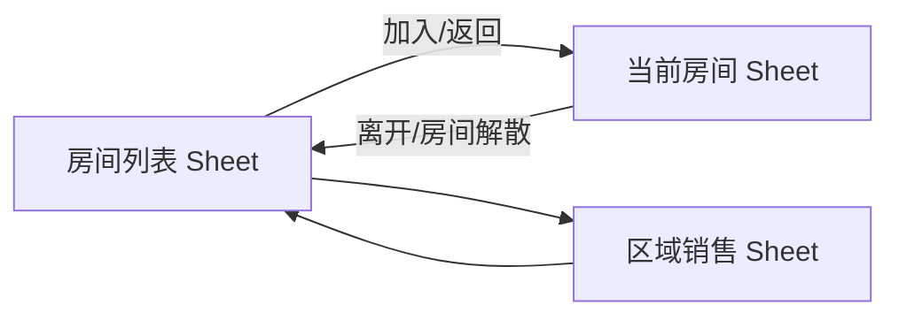
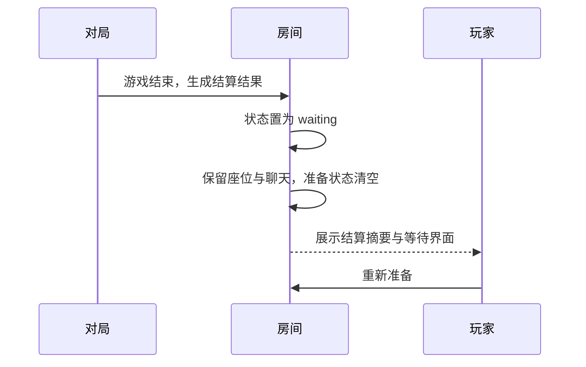

# PRD · REQ-2026-004 · 规则完备、房间生命周期与 Sheet 架构拆分

- **版本**：v1
- **作者**：prd-author
- **状态**：①产品设计 / 定稿候选
- **时间**：2026-07-04
- **前置**：REQ-2026-001（账号/大厅/版本）、REQ-2026-002（锦囊与正式房基础）、REQ-2026-003（UX 与玩法体验补全）
- **SSOT 声明**：本 PRD 定义 REQ-2026-004 的产品范围；进入评审并通过后，研发、测试与后续设计以当前生效版本为准。

## 1. 背景与目标

### 1.1 现状问题

当前版本已经具备账号、大厅、正式房基础流程与部分锦囊/选将能力，但离可长期扩展的三国杀联机体验仍有五类关键缺口：

1. **Sheet 不是稳定页面边界**：当前 Sheet 更接近本地显示状态，房间列表、当前房间、伪装表格与 Ribbon 动作存在耦合；后续增加更多游戏会推高维护成本。
2. **规则可信度不足**：卡牌与角色技能需要逐条对齐游戏规则；例如【过河拆桥】必须可拆手牌、装备区、判定区，【闪电】未生效时必须轮转到下家判定区，张飞【替身】已发现未生效。
3. **版本扩展缺少开放门槛**：未来会接入神话再临等版本；若没有规则矩阵与完成度门槛，版本选择会变成“可点但不完整”。
4. **房间生命周期不闭环**：游戏结束后应回到等待中；房主退出应轮转；主动中途退出需要提示、扣费与托管边界。
5. **玩家信息与成长经济未成体系**：玩家昵称、角色身份、战绩、等级、金币、签到与结算奖励需要先形成可扩展的产品规则。

### 1.2 价值主张

把项目从“可演示的联机三国杀”推进到“规则可核验、版本可扩展、界面可维护、房间可循环游玩”的基础形态。

### 1.3 成功指标

| 指标 | 目标 |
|---|---|
| Sheet 隔离 | 切换到房间列表、当前房间、区域销售时，主内容区与 Ribbon 功能区 100% 按 Sheet 上下文展示 |
| 维护边界 | 当前房间相关动作不在房间列表 Sheet 显示；伪装表格 Sheet 不显示游戏动作 |
| 标准版人数 | `standard-2014` 房间可开始人数为 2-8 人；超过 8 人不可开始并有明确提示 |
| 规则矩阵 | 标准版·界限突破 30 名武将、全部基础牌/锦囊牌/装备牌均有规则矩阵与验收用例 |
| 技能完整度 | 标准版·界限突破所有角色技能均真实结算，不允许仅展示或标记暂不支持 |
| 卡牌正确度 | 【过河拆桥】【顺手牵羊】【闪电】等已点名规则 100% 对齐游戏规则 |
| 房间循环 | 一局结束后房间回到等待中，保留座位与聊天，准备状态重置，结算记录可追溯 |
| 玩家信息 | 点击玩家昵称可查看公开信息：昵称、按游戏类型统计的战绩、财富、等级 |

## 2. 用户 & 场景

| 用户 | 场景 |
|---|---|
| 房主 | 在房间列表创建标准版房间，人数达到 2-8 人后开始游戏；超过 8 人时得到明确提示 |
| 联机玩家 | 在底部 Sheet 间切换，希望房间列表与当前房间功能互不干扰 |
| 对局玩家 | 游戏中查看其他玩家，只能看到手牌数；涉及拆/顺等操作时看到匿名手牌项 |
| 老玩家 | 使用【闪电】、【过河拆桥】、张飞【替身】等规则敏感内容，期望与三国杀规则一致 |
| 房主/玩家 | 一局结束后继续留在同一房间，重新准备并开下一局 |
| 中途退出玩家 | 游戏中点击离开时看到扣费与托管提示，确认后才主动退出并扣金币到最低 0 |
| 新版本维护者 | 接入神话再临等版本前，先补齐该版本规则矩阵，未完成不可开放选择 |
| 资料查看者 | 点击玩家昵称查看该玩家公开资料，不暴露邮箱、真实 userId 等账号敏感信息 |

## 3. 交付阶段

| 阶段 | 优先级 | 范围 | 说明 |
|---|---|---|---|
| Phase 1 | P0-first | Sheet 架构与房间生命周期 | 先拆页面边界、隔离 Ribbon、处理房间结束回等待、房主轮转、主动退出提示/托管边界 |
| Phase 2 | P0-core | 全卡牌/全技能规则结算 | 标准版·界限突破规则矩阵、卡牌效果、张飞【替身】、闪电轮转、全角色技能真实结算 |
| Phase 3 | P1-delay | 成长经济与签到 | 经验、金币、等级、签到、其它游戏入场券扩展口；本轮设计保留，可延期实现 |

> 用户确认：先做 Sheet 优化与结构调整，再做全技能全卡牌结算；房间生命周期放入 Phase 1。

## 4. 需求点列表

### 4.1 Sheet 与功能区

| 编号 | 需求点 | 优先级 | 备注 |
|---|---|---|---|
| R-SHEET-01 | Sheet 作为一级功能入口：仅保留「房间列表」「当前房间」「区域销售」三个初始 Sheet | P0 | 「当前房间」未进房时隐藏或置灰均可，由评审确认交互 |
| R-SHEET-02 | 每个 Sheet 拥有独立主界面、页面状态与功能区上下文 | P0 | 目标是降低后续扩展其它游戏的维护成本 |
| R-SHEET-03 | 切换 Sheet 后，上方 Ribbon 内容必须随 Sheet 变更 | P0 | 房间内可有模拟开局/添加角色；房间列表不显示这些动作 |
| R-SHEET-04 | Sheet route 可采用内部路由或 URL 路由；产品要求是边界清晰、刷新可恢复、性能不退化 | P0 | 地址栏是否变化不作产品强制 |
| R-SHEET-05 | 右上角「保存」按钮文案改为「签到」，点击触发每日签到入口 | P1 | 实现可随 Phase 3 延期；文案入口先预留 |

### 4.2 房间生命周期

| 编号 | 需求点 | 优先级 | 备注 |
|---|---|---|---|
| R-ROOM-01 | 游戏结束后房间状态从进行中变更为等待中 | P0 | 不停留在不可复用的 finished 状态 |
| R-ROOM-02 | 游戏结束后保留原玩家座位与聊天记录，所有玩家准备状态重置为未准备 | P0 | 上一局结果进入结算记录 |
| R-ROOM-03 | 房主退出时立即轮转给下一个玩家；若没有下一个玩家，则解散房间 | P0 | waiting/selecting/playing 均适用 |
| R-ROOM-04 | playing/selecting 中玩家点击离开时弹窗提示：确认后主动退出并扣 5 金币，最低扣至 0 | P0 | 仅主动确认退出扣费 |
| R-ROOM-05 | 掉线、关闭浏览器、网络中断不视为主动退出，进入托管/保坐流程，不扣金币 | P0 | 与 REQ-003 重连能力联动 |
| R-ROOM-06 | 标准版·界限突破房间人数限制为 2-8 人；超过 8 人不能开始游戏 | P0 | 房间列表/房间内均需显示中文版本名与人数限制 |

### 4.3 规则与版本

| 编号 | 需求点 | 优先级 | 备注 |
|---|---|---|---|
| R-RULE-01 | 建立规则 SSOT：先修正项目内 `docs/cards/*.md` 与版本配置，缺失或冲突处以官方/通行规则为准 | P0 | PRD 不绑定具体技术实现 |
| R-RULE-02 | 标准版·界限突破全部卡牌效果必须落地到位，不允许与游戏规则偏差 | P0 | 基本牌、锦囊牌、装备牌全覆盖 |
| R-RULE-03 | 【过河拆桥】可弃置目标手牌、装备区、判定区的一张牌；手牌选择仅显示匿名项 | P0 | 例：手牌1、手牌2 |
| R-RULE-04 | 【顺手牵羊】及类似获得/抽取区域牌效果同样按规则覆盖手牌、装备区、判定区；手牌匿名 | P0 | 受距离与目标合法性约束 |
| R-RULE-05 | 【闪电】判定未生效时不进入弃牌堆，必须移入下家判定区继续轮转；直到被拆、被获得/移动、或判定生效后才离开判定区 | P0 | 以规则勘误表最终描述为准 |
| R-RULE-06 | 标准版·界限突破 30 将全部技能必须真实结算，不允许仅展示、不允许标记暂不支持 | P0 | 角色技能是三国杀核心，优先级高于成长经济 |
| R-RULE-07 | 排查并修复张飞【替身】未生效问题；同时输出全角色技能配置与实现状态矩阵 | P0 | 矩阵需覆盖技能时机、交互、默认超时、验收用例 |
| R-RULE-08 | 未来版本未完成规则矩阵与真实结算前，不可在房间版本中开放给玩家选择 | P0 | 支持神话再临等后续版本扩展 |
| R-RULE-09 | 选将规则按当前版本游戏规则执行，并改为全员同时选择；超时默认候选第一名 | P0 | 不允许重复武将；候选池也不重复 |
| R-RULE-10 | 标准版因候选不重复限制，当前开放 2-8 人 | P0 | 避免 10 人局候选总量超过 30 将 |

### 4.4 对局与资料展示

| 编号 | 需求点 | 优先级 | 备注 |
|---|---|---|---|
| R-UI-01 | 游戏界面玩家展示格式改为 `[房主]用户昵称`，非房主仅展示用户昵称 | P0 | 房主标识只标当前房主 |
| R-UI-02 | 角色名展示格式改为 `势力-角色名【身份】` | P0 | 身份暗置时按规则隐藏，仅在可见场景展示 |
| R-UI-03 | 技能详情中的「操控名」改为「玩家」 | P0 | 文案统一 |
| R-UI-04 | 默认所有人互相可见手牌数，但不可查看具体手牌 | P0 | 列表显示数量即可 |
| R-UI-05 | 点击玩家昵称打开公开资料弹窗 | P1 | 显示昵称、按游戏类型战绩、财富、等级；不展示邮箱/账号/真实 userId |
| R-UI-06 | 房间列表「版本」列显示中文版本名，例如「标准版·界限突破」 | P0 | 不显示 `standard-2014` 编码 |
| R-UI-07 | 点击版本中文名打开只读版本详情，展示当前版本角色、卡牌等信息，不提供切换版本能力 | P1 | 版本切换仍走既有入口 |

### 4.5 成长经济（延期设计）

| 编号 | 需求点 | 优先级 | 备注 |
|---|---|---|---|
| R-PROG-01 | 每局结束后按胜负发放经验与金币：胜利 +30 经验 +10 金币，失败 +10 经验 +3 金币 | P1 | 奖励值必须可配置 |
| R-PROG-02 | 等级仅展示，初始等级曲线可配置；后续预留房主设置加入等级条件 | P1 | 本轮不做加入等级限制 |
| R-PROG-03 | 每日签到每日一次，奖励 +50 金币 +10 经验，不做连续签到 | P1 | 入口为右上角「签到」 |
| R-PROG-04 | 三国杀免费；其它游戏未来在开始游戏时扣 5 金币作为入场券 | P2 | 本轮只设计扩展口，不阻塞三国杀规则交付 |

## 5. 交互设计

### 5.1 Sheet 与 Ribbon

- 「房间列表」显示可加入房间、版本中文名、人数、状态、返回入口。
- 「当前房间」承载等待、选将、对局、结算后的等待状态。
- 「区域销售」保留伪装表格能力，不显示游戏操作按钮。
- Ribbon 必须按当前 Sheet 输出动作；动作缺失或错位均视为验收失败。

### 5.2 房间结束后循环

### 5.3 主动退出与托管

- waiting 中离开：直接离开；若是房主，房主轮转；若无人则解散。
- selecting/playing 中点击离开：展示确认弹窗，说明「确认离开将扣除 5 金币，最低扣至 0；取消则继续留在房间」。
- selecting/playing 中关闭页面、掉线或网络中断：不扣金币，进入托管/保坐流程。
- 玩家主动退出后，房主若离开则立即轮转，不等待保坐期。

### 5.4 玩家资料弹窗

点击玩家昵称打开弹窗，字段包括：

| 字段 | 说明 |
|---|---|
| 昵称 | 对外展示昵称 |
| 战绩 | 按游戏类型展示，例如：三国杀：3胜/1负/胜率75% |
| 财富 | 当前金币数 |
| 等级 | 当前等级与经验进度 |

不展示邮箱、登录账号、真实 userId；历史对局详情只预留扩展口，本轮不做详细列表。

### 5.5 选将

- 选将候选数量、身份、主公规则以当前版本规则为准。
- 选将阶段全员同时选择，最长 3 分钟。
- 超时未选时，服务端默认选择该玩家候选列表第一名。
- 同一局内不允许重复武将；候选池本身不重复。
- 标准版·界限突破当前限制 2-8 人，避免不重复候选池不足。

## 6. 规则与约束（领域敏感）

### 6.1 规则来源优先级

1. 项目内 `docs/cards/*.md`、`docs/gameplay.md` 与当前版本配置是本项目规则 SSOT。
2. 若项目文档缺失、不完整或互相冲突，以《三国杀标准版·界限突破 2014》官方/通行规则为准。
3. 研发前必须先补齐规则勘误与规则矩阵；矩阵未完成的版本不得开放给玩家选择。

### 6.2 标准版·界限突破范围

- 当前版本名称：标准版·界限突破。
- 当前开放人数：2-8 人。
- 当前武将池：30 将。
- 当前要求：全部卡牌、全部角色技能真实结算。

### 6.3 已点名规则要求

| 项目 | 规则要求 |
|---|---|
| 过河拆桥 | 可弃置目标手牌、装备区、判定区一张牌；手牌匿名展示 |
| 顺手牵羊 | 可获得目标合法区域一张牌；手牌匿名展示；受距离约束 |
| 闪电 | 未判定生效时轮转到下家判定区；判定生效、被拆或被移动后才离开判定区 |
| 张飞【替身】 | 准备阶段按规则可发动限定技，回复至上回合结束时体力并摸等量牌 |
| 手牌数 | 所有玩家默认互相可见手牌数量，不可见具体手牌 |

### 6.4 版本开放门槛

新增版本（如神话再临）必须满足：

- 有中文版本名、人数范围、角色池、卡牌池说明。
- 有完整规则矩阵。
- 所有对玩家开放的角色技能与卡牌效果均可真实结算。
- 未完成矩阵或真实结算前，不得在房间创建/版本选择中开放。

## 7. 非功能要求

| 类别 | 要求 |
|---|---|
| 性能 | Sheet 切换不得导致明显卡顿；当前房间对局状态切换后操作响应不退化 |
| 可维护 | Sheet、Ribbon、房间、规则、成长经济边界清晰，便于后续增加其它游戏 |
| 可观测 | 房间结束回等待、主动退出扣费、托管进入、房主轮转、闪电轮转、技能触发均需有可追踪日志 |
| 兼容 | 保持 WPS 伪装体验；地址栏是否变化不强制，但刷新恢复不能退化 |
| 安全 | 玩家资料弹窗不得暴露邮箱、真实 userId、登录凭证等敏感信息 |
| 可测性 | 每张卡牌、每个技能至少有一条可执行验收用例或矩阵记录 |

## 8. 验收标准

| AC | 描述 | ref |
|---|---|---|
| AC-SHEET-01 | 底部 Sheet 初始仅有「房间列表」「当前房间」「区域销售」三个一级入口 | R-SHEET-01 |
| AC-SHEET-02 | 切到房间列表时，Ribbon 不显示模拟开局、添加角色、出牌等当前房间动作 | R-SHEET-03 |
| AC-SHEET-03 | 切到当前房间时，Ribbon 只显示与房间状态相关的动作 | R-SHEET-02/03 |
| AC-ROOM-01 | 游戏结束后房间回到 waiting，座位和聊天保留，准备状态清空 | R-ROOM-01/02 |
| AC-ROOM-02 | 房主退出后房主轮转给下一个玩家；无人时房间解散 | R-ROOM-03 |
| AC-ROOM-03 | playing/selecting 中主动离开弹窗提示扣 5 金币，确认后扣至最低 0 | R-ROOM-04 |
| AC-ROOM-04 | 掉线/关闭浏览器不扣金币，进入托管或保坐 | R-ROOM-05 |
| AC-ROOM-05 | 标准版·界限突破超过 8 人不可开始游戏，提示人数限制 | R-ROOM-06 |
| AC-RULE-01 | 【过河拆桥】可选择目标手牌、装备区、判定区；手牌匿名 | R-RULE-03 |
| AC-RULE-02 | 【闪电】未生效时移动到下家判定区继续轮转 | R-RULE-05 |
| AC-RULE-03 | 张飞【替身】在准备阶段按规则生效 | R-RULE-07 |
| AC-RULE-04 | 输出标准版 30 将技能矩阵，所有技能真实结算，无 unsupported 标记 | R-RULE-06/07 |
| AC-RULE-05 | 新版本未完成规则矩阵时，不可在房间版本选择中开放 | R-RULE-08 |
| AC-UI-01 | 玩家展示为 `[房主]用户昵称` 或 `用户昵称` | R-UI-01 |
| AC-UI-02 | 角色名展示为 `势力-角色名【身份】`，身份暗置时按规则隐藏 | R-UI-02 |
| AC-UI-03 | 技能详情中不再出现「操控名」，改为「玩家」 | R-UI-03 |
| AC-UI-04 | 房间列表版本列显示「标准版·界限突破」等中文名 | R-UI-06 |
| AC-PROG-01 | 成长经济配置项存在设计入口，不阻塞 Phase 1/2 交付 | R-PROG-01~04 |

## 9. 非目标

- 本轮不开放神话再临等新版本，只建立开放门槛与扩展规则。
- 本轮不做详细历史对局列表。
- 本轮不做连续签到奖励。
- 本轮不做等级加入门槛，仅预留后续扩展。
- 本轮不要求改地址栏 URL；只要求 Sheet 具备清晰页面边界。

## 10. 产品维度自检

- [x] **清晰**：每条需求有明确对象、行为、边界与验收。
- [x] **完整**：覆盖 Sheet、Ribbon、房间生命周期、规则矩阵、全技能、展示、经济延期设计。
- [x] **价值**：直接对应规则可信、维护成本、循环开局与后续版本扩展。
- [x] **优先级**：按 Phase 1/2/3 拆分，先结构与生命周期，再规则核心，经济延期。

## 11. 评审结论回写区

> 待 frontend-feasibility / backend-feasibility / qa-testability 评审后由 prd-author 回写。

## 12. CR 草案

REQ-2026-004：在 REQ-003 基础上，先拆分 Sheet 一级入口与 Ribbon 上下文、补齐房间结束回等待/房主轮转/主动退出扣费与托管边界；随后以标准版·界限突破为基准建立规则矩阵，完成全部卡牌与 30 将技能真实结算，并为未来神话再临等版本设置“矩阵未完成不可开放”的产品门槛；成长经济和签到作为 P1 延期设计保留配置化扩展口。

[handoff] 交由 lifecycle-orchestrator，阶段候选：①产品设计 → ②评审会签

