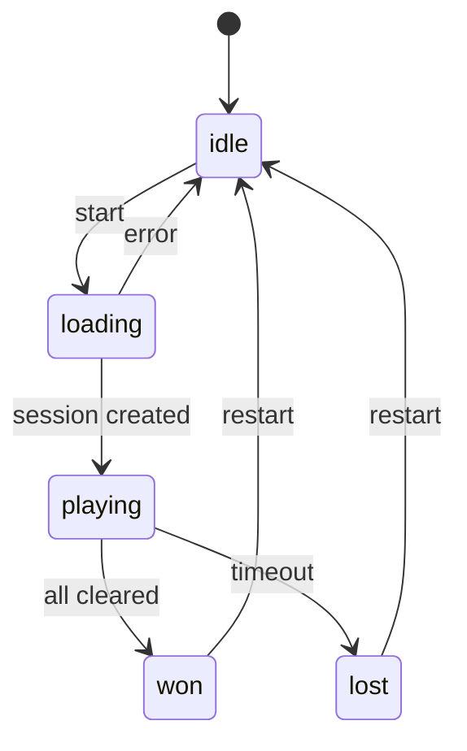

# 前端技术方案 · REQ-2026-005 · v1

- **状态**：ready-for-implementation
- **时间**：2026-07-05
- **依据**：[PRD v2](../prd/prd.v2.md)、[API 契约 v1](./api-contract.v1.md)

## 1. 组件变更

| 组件/文件 | 变更 |
|---|---|
| `data/decoy.ts` | 增加 `LIANLIANKAN_SHEET_ID`、Sheet 标签和默认文件名 |
| `SheetTabs.tsx` | 增加连连看 tab |
| `TitleBar.tsx` | 增加右上角账号 label |
| `ChatPanel.tsx` / `LobbyChatPanel.tsx` / `BattleGrid.tsx` | 聊天消息展示时间 |
| `BattleGrid.tsx` | 玩家名可点击、侧栏折叠收敛、铺满 filler |
| `PlayerProfileModal.tsx` | 新增玩家资料弹窗 |
| `LianliankanGrid.tsx` | 新增连连看 Sheet 主体 |
| `api/profile.ts` | 获取公开玩家资料 |
| `api/lianliankan.ts` | 获取配置、创建 session、结算 |
| `store/appStore.ts` | 接入资料和连连看 API；钱包变化沿用 user 字段 |

## 2. 工具函数

- `formatChatTime(timestamp, now = Date.now())`：当天 `HH:mm`，跨天 `MM-DD HH:mm`。
- `stripGeneralPrefixInText` 继续用于武将名展示清洗。
- `canConnect(board, a, b)`：连连看不超过两次转弯路径判断。

## 3. 战场折叠

- 删除重复的 `collapsedHandle` / `collapseToggle` 双入口，保留单一 `sideRail`。
- 展开：`grid-template-columns: minmax(0, 1fr) 360px`。
- 折叠：`grid-template-columns: minmax(0, 1fr) 32px`。
- `aside` 不在折叠态占 360px 隐藏宽度。
- 根据容器尺寸计算额外 filler 行/列，使主表格铺满。

## 4. 连连看 UI

- 第一行/工具条：主题、难度、emoji/文字切换、开始/重开、倒计时、金币信息。
- 棋盘使用 WPS 单元格样式，固定单元格尺寸，外围生成普通空白单元格。
- 已消除 tile 仍保留单元格边框，只清空内容。
- 选中态使用绿色边框，与 WPS 当前单元格风格一致。

## 5. 状态机

## 6. 资料弹窗

- 点击有 `userId` 的玩家名请求公开资料。
- 点击虚拟角色直接展示“虚拟角色”空态。
- 请求失败展示错误空态，不阻塞主界面。

